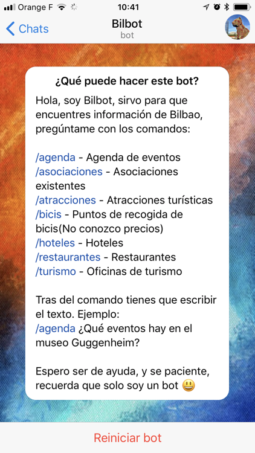
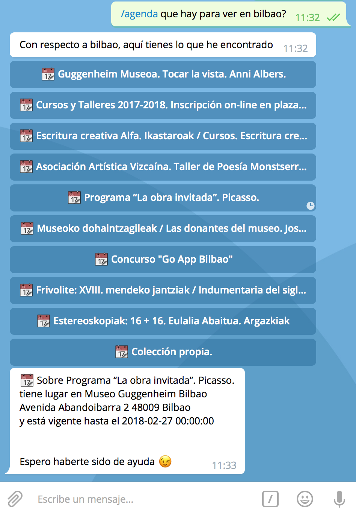
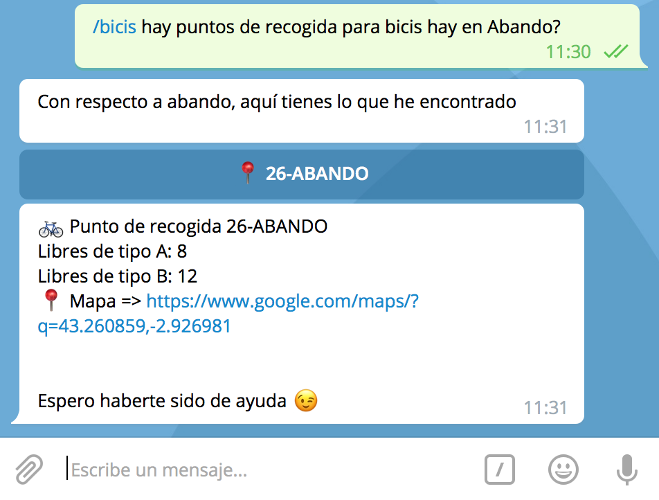
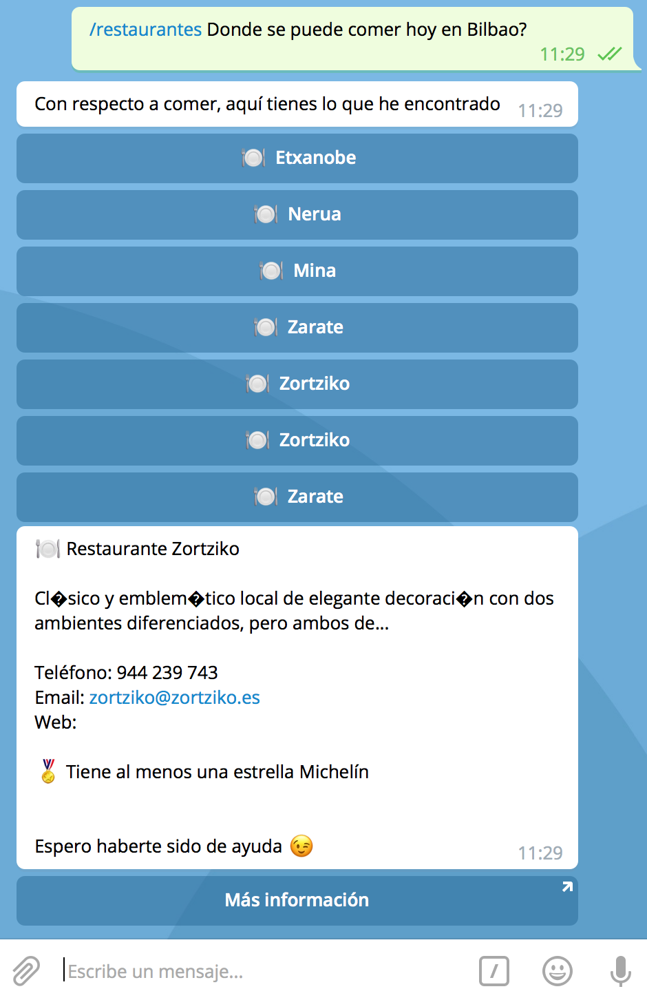

# Bilbot

Design of an extensible chatbots cloud architecture for its application to the improvement of the consumption and the exploitation of public services and data.

## Screenshots
   

## Getting Started

These instructions will get you a copy of the project up and running on your local machine for development and testing purposes. See deployment for notes on how to deploy the project on a live system.

### Prerequisites

* [Docker](https://www.docker.com/)
* [Docker compose](https://docs.docker.com/compose/)
* [Capistrano](http://capistranorb.com/)

### How to run

This project is fully Dockerized and orchestrated with Docker Compose, is mandatory to have previously installed both.

Create your version of `src/bilbot-php/www/Constants.php.dist` without the `.dist` extension and your API keys.

Build the images:

```
docker-compose build
```

Run the services:
```
docker-compose up -d
```

Prepare the environment:

1. Log in to the `watson-php` container by running the following command:
    ```
    docker exec -it bilbotpfm_watson-php_1 bash
    ```

2. Install dependencies by running the following command:
    ```
    cd /var/www/docker-symfony && composer install -n
    ```

3. Change `/tmp` dir permissions:
    ```
    chown -R www-data:www-data /tmp
    ```
    
Do the same process with `welive-php` container.

Open Telegram and search the bot `@bilb0_bot` to start a conversation.

### Commands

You can ask to the bot information using the following commands:

* `/agenda` for information about events.
* `/bicis` for information about bike rental service.
* `/asociaciones` for information about clubs.
* `/hoteles` for information about accomodation.
* `/restaurantes` for information about restaurants.
* `/atracciones` for information about tourist attractions.

Get fun with him asking information!

### If you want to access directly to microservices from your computer update your hosts

#### Mac OS X

Add the following line to your `/etc/hosts` file:
```
127.0.0.1 bilbot.dev
```

#### Windows

Add the following line to your `%SystemRoot%\System32\drivers\etc\hosts` file:
```
127.0.0.1 bilbot.dev
```

The web server is constantly querying the Telegram API for new messages sent to Bilbot, for stopping the containers:
```
docker-compose down
```

To remove the built image for starting from scratch:
```
docker-compose down
docker-compose rm
```

All the received messages are stored in a MySQL Database which can be accessed in localhost.

## Microservices

| Name | Address | Description|
| --- | --- | --- |
| bilbot |bilbot.dev:80 | Contains the Telegram bot API logic and the user commands. |
| bilbot-watson |bilbot.dev:81 | Contains the Watson API querying logic and is based on Symfony. Contains a testing index page. |
| bilbot-welive |bilbot.dev:82 | Contains the WeLive API querying logic and is based on Symfony. Contains a testing index page. |

## Deployment

The deployment process is orchestrated by Capistrano, a tool written in ruby to encapsulate each environment 
configuration specifications.

For deploying a new version in dev:

```
cap dev deploy
```

### How to add a new command

1. Create a new Controller with all the needed queries to the dataset inside of `src/bilbot-welive/src/AppBundle/Controller/REST`
    1. Create at least 3 types of queries `listAction`, `detailAction` and `searchAction` for making easier the interaction with the bot
1. Add the routing for the actions inside of `src/bilbot-welive/src/AppBundle/Resources/config/routing_api.yml` following the naming convention `{dataType}_{action_name}`
1. Create a new command file in `src/bilbot-php/www/Commands` with the name `{CommandNameCommand.php}` is highly recommended to duplicate an existing one and changing the name of the class within
1. Change the class properties `$name`, `$description`, `$usage` and the constants `WELIVE_SEARCH_METHOD`, `WELIVE_LIST_METHOD` and `DATA_PREFIX`, please note that these are the route slugs created in step 2. `DATA_PREFIX` is recommended to be one word with a trailing underscore (_) should be descriptive of the type of data, this will be used by the `CallbackqueryCommand.php` for handling the origin of the callbacks.
1. Customize the button text representation within `search` function and the data column to be represented as title.
1. Add the data prefix without the trailing underscore to the `$entities` associative array in `CallbackqueryCommand.php` with the subkeys `action` to represent the detail route slug created in step 2 and `column` for the column that will be used as primary key for the search, it must be consistent with the argument that will receive the detail action in the controller.
1. Add a new switch clause in the function `buildAnswer` using the data prefix without trailing underscore with the text that will be rendered as answer to the user.
1. Add the new file command path to  `src/bilbot-php/www/init.php`
1. Restart docker containers with `docker-compose down && docker-compose up`
1. Text BotFather in Telegram to update the user visible command list

## Built With

* [PHP Telegram Bot](https://github.com/php-telegram-bot) - A Telegram bot framework in PHP
* [Telegram](https://telegram.org/) - Telegram Instant Messaging platform.
* [IBM Watson](https://www.ibm.com/watson/) - AI engine
* [WeLive](http://welive.eu/) - Datasets sources
* [Symfony](https://symfony.com/) - Web Framework

## Versioning

We use [SemVer](http://semver.org/) for versioning. For the versions available, see the [tags on this repository](https://github.com/Bilbot/tags). 

## Authors

* **Aitor Brazaola** - *Main developer* - [GitHub](https://github.com/kronosnhz)

## License

This project is licensed under the GPL v3 License - see the [LICENSE.md](LICENSE) file for details

## Acknowledgments

* [docker-symfony](https://github.com/sskorc/docker-symfony) - Szymon Skórczyński
* [Example Bot Telegram](https://github.com/php-telegram-bot/example-bot) - PHP Telegram Bot Developers
* Coffe & Daft Punk
